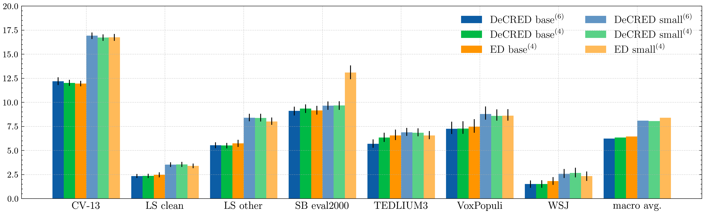
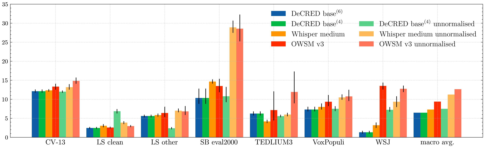

# DeCRED: Improving Automatic Speech Recognition with Decoder-Centric Regularization in Encoder-Decoder Models

## Overview
This repository contains the implementation of **DeCRED** (**De**coder-**C**entric **R**egularization in **E**ncoder-**D**ecoder), a novel approach aimed at improving automatic speech recognition (ASR) systems. DeCRED enhances model robustness and generalization, particularly in out-of-domain scenarios, by introducing auxiliary classifiers in the decoder layers of encoder-decoder ASR architectures.

## Key Features
- **Auxiliary Classifiers**: DeCRED integrates auxiliary classifiers in the decoder module to regularize training, improving the model’s ability to generalize across domains.
- **Enhanced Decoding**: Proposes two new decoding strategies that leverage auxiliary classifiers to re-estimate token probabilities, resulting in more accurate ASR predictions.
- **Strong Baseline**: Built on the **E-branchformer** architecture, ED achieves competitive word error rates (WER) compared to Whisper-medium and OWSM v3, while requiring significantly less training data and a smaller model size.
- **Out-of-Domain Performance**: DeCRED demonstrates strong generalization, reducing WERs by 2.7 and 2.9 points on the AMI and Gigaspeech datasets, respectively.

## Results

The figure below compares the Word Error Rates (WERs) of the DeCRED model to the encoder-decoder (ED) baseline:



Below are WER comparisons between DeCRED, Whisper-medium, and OWSM v3 systems:



The table below presents WER results for DeCRED and ED systems across various out-of-domain datasets, including FLEURS, AMI, and Gigaspeech:

| Model                             | FLEURS | AMI-ihm | Gigaspeech |
|-----------------------------------|--------|---------|------------|
| $\text{ED base}^{(4)}$            | 6.4    | 24.8    | 19.8       |
| $\text{DeCRED base}^{(4)}$        | 6.7    | 22.1    | 16.9       |
| $\text{DeCRED base}^{(6)}$        | 6.9    | 21.9    | 17.0       |
| $\text{DeCRED base}^{(6)\dagger}$ | 6.8    | 21.4    | 16.4       |
| $\text{OWSM v3}$                  | 8.6    | 35.8    | 34.1       |
| $\text{Whisper medium}$           | **5.5**| **16.6**| **14.9**   |

The following table summarizes the Zero-Attention Internal Language Model (ILM) BPE-level perplexity estimation for both DeCRED and ED models across several datasets:

| Model           | CV-13 | LS clean | LS other | SB eval2000 | TEDLIUM3 | VoxPopuli | WSJ  | FLEURS | AMI-ihm | Gigaspeech |
|-----------------|-------|----------|----------|-------------|----------|-----------|------|--------|---------|------------|
| $\text{DeCRED}$ | 141.0 | 129.1    | 140.4    | 104.1       | 89.0     | 101.4     | 126.0| 111.5  | 136.6   | 66.3       |
| $\text{ED}$     | 232.4 | 206.1    | 199.9    | 220.3       | 134.6    | 142.7     | 177.3| 159.7  | 308.3   | 84.0       |

## Models on Hugging Face Hub
- **ED Base**: [BUT-FIT/ED-base](https://huggingface.co/BUT-FIT/ED-base)
- **ED Small**: [BUT-FIT/ED-small](https://huggingface.co/BUT-FIT/ED-small)
- **DeCRED Base**: [BUT-FIT/DeCRED-base](https://huggingface.co/BUT-FIT/DeCRED-base)
- **DeCRED Small**: [BUT-FIT/DeCRED-small](https://huggingface.co/BUT-FIT/DeCRED-small)

## Usage

### Inference
To perform inference, please visit our [Hugging Face Space](https://huggingface.co/spaces/BUT-FIT/DeCRED-ASR) to test the pre-trained DeCRED model in real-time. 

However, for better performance, we recommend testing it locally due to hardware limitations from running on the free version of Hugging Face Spaces. 

You can also refer to the [demo](demo.ipynb) notebook for additional examples on how to use the model.

### Training

To train a DeCRED model, follow these steps:

1. Set up a Python 3.10 environment, clone the repository, initialize submodules, and install the requirements.

    ```bash
    # Clone the repository
    git clone git@github.com:BUTSpeechFIT/DeCRED.git
    cd DeCRED

    # Optional: Create a new conda environment with Python 3.10
    # conda create -n hf_asr python=3.10 
    # conda activate hf_asr
    
    # Create a virtual environment
    python -m venv decred_venv
    source decred_venv/bin/activate
    
    git submodule init
    git submodule update
    cd huggingface_asr

    # Install the requirements
    pip install -r requirements.txt
    cd ..
    ```

2. Set up the environment variables in the `env.sh` file.

    ```bash
    # Activate the newly created environment
    source decred_venv/bin/activate
   
    export PROJECT="DeCRED"
    export WORK_DIR="/mnt/proj1/open-28-58/lakoc/DeCRED"
    export HF_HOME="${WORK_DIR}/huggingface_cache"
    export OMP_NUM_THREADS=64
    export PYTHONPATH="${PYTHONPATH}:${WORK_DIR}/huggingface_asr"
    ```

3. Update the paths to WSJ and Fisher datasets in Kaldi format in `recipes/datasets.json`. If you don’t have local instances of these datasets, remove the corresponding entries from the file. Alternatively, you can prune the dataset list to train and evaluate the model on.

4. Run the data preparation script. (Optionally, store the prepared dataset using the `--dump_prepared_dataset_to` argument to speed up future loading.)

    ```bash
    sbatch recipes/data_prep.sh
    ```

5. Train the tokenizer. (This step can be skipped if you prefer to use an existing tokenizer.)

    ```bash
    sbatch recipes/tokenizer.sh
    ```

6. Initialize the feature extractor, encoder, and decoder configurations. (You can skip this step if you're using existing configurations.)

    ```bash
    sbatch recipes/initialize_models.sh
    ```

7. Train the model by selecting the appropriate recipe.

    ```bash
    sbatch recipes/decred_base.sh
    ```

## Citation
If you use DeCRED in your research, please cite the following paper:

```
@misc{polok_2024_decred,
  title={Improving Automatic Speech Recognition with Decoder-Centric Regularization in Encoder-Decoder Models},
  author={Alexander Polok, Santosh Kesiraju, Karel Beneš, Lukáš Burget, Jan Černocký},
  year={2024},
}
```

## Contact
For any questions or suggestions, feel free to reach out to [ipoloka@fit.vut.cz](mailto:ipoloka@fit.vut.cz).

---

Contributions are welcome! Feel free to open issues or submit pull requests.